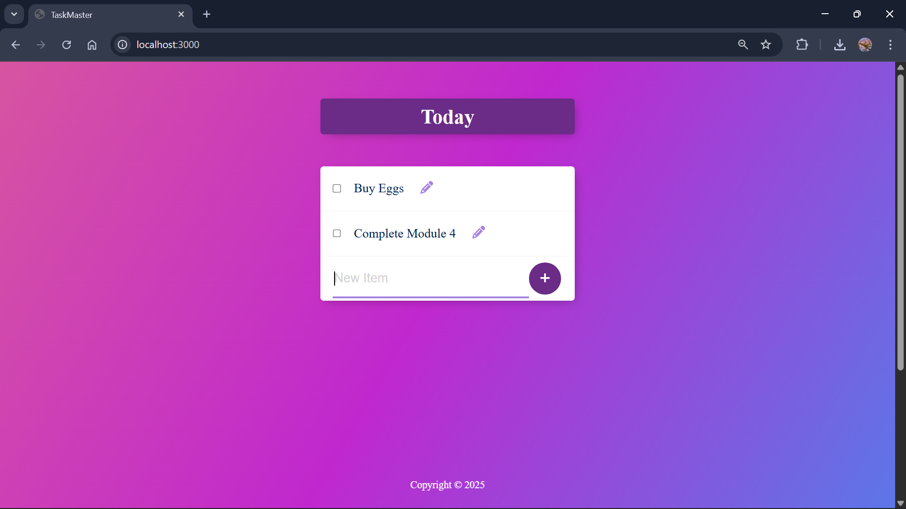

# TaskMate – A Simple To-Do List App

A lightweight and user-friendly To-Do List web application built with Node.js, Express, PostgreSQL, and EJS. This app helps users keep track of their daily tasks with a simple interface and dynamic functionality.

---

## 🚀 Features

- Add new tasks
- View existing tasks
- Delete completed tasks
- Clean and responsive UI
- Backend powered by Express and PostgreSQL
- EJS templating for server-side rendering

---

## 🛠️ Technologies Used

- Node.js
- Express.js
- PostgreSQL
- EJS (Embedded JavaScript Templates)
- HTML, CSS

---

## 📂 Project Structure

```
/project-root
├── public/             # Static files (CSS, JS)
├── views/              # EJS templates
├── node_modules/
├── index.js            # Main server file
├── package.json
├── .env (not included)
└── .gitignore
```

---

## ⚙️ Setup Instructions

1. Clone the repository:
   ```bash
   git clone https://github.com/LakshmiDhandapani/taskmate.git
   cd taskmate
   ```

2. Install dependencies:
   ```bash
   npm install
   ```

3. Create a `.env` file and add your PostgreSQL connection variables:
   ```env
   PG_USER=your_username
   PG_HOST=localhost
   PG_DATABASE=your_database
   PG_PASSWORD=your_password
   PG_PORT=5432
   ```

4. Run the app:
   ```bash
   nodemon index.js
   ```

5. Visit [http://localhost:3000](http://localhost:3000) in your browser.

---

## 🖼️ Screenshot



---

## 👩‍💻 Author

- **Lakshmi**  
- [GitHub - LakshmiDhandapani](https://github.com/LakshmiDhandapani)

---

## 📜 License

This project is licensed under the MIT License.
